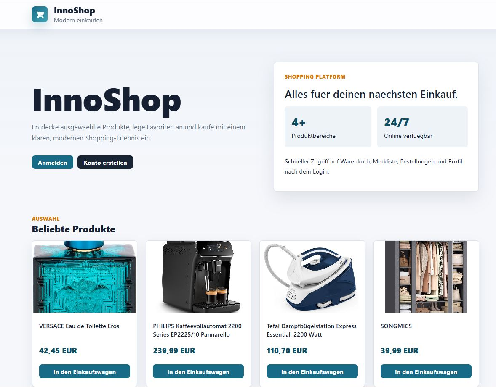
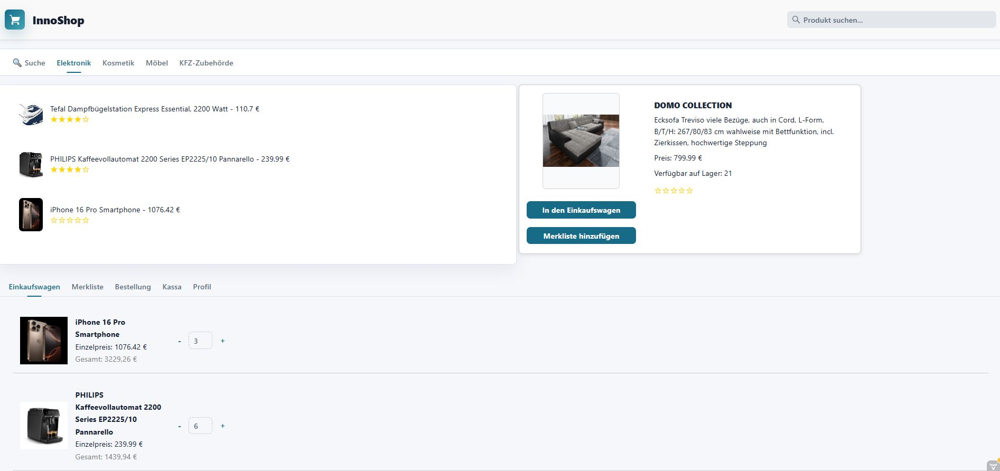
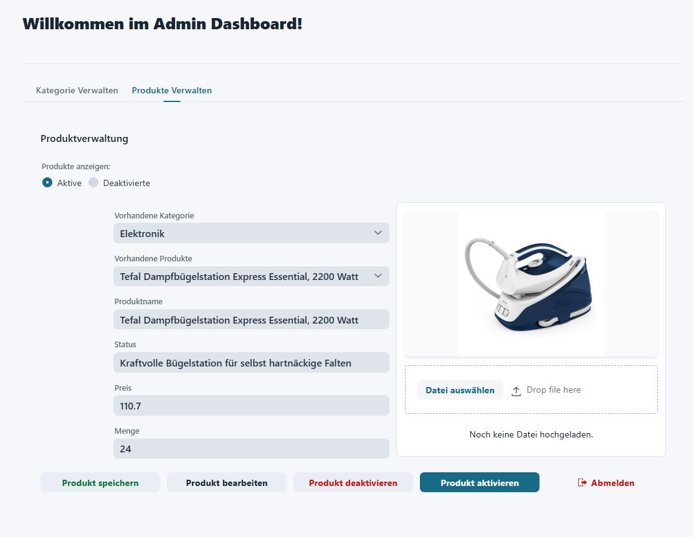

<div align="center">

# 🛍️ Welcome to InnoShop

### A modern full-stack e-commerce web application built with Java, Vaadin and PostgreSQL

<br>


<br>

**InnoShop** is a Java-based shopping platform that allows users to browse products, manage a shopping cart, save favorites, place orders and use an admin dashboard for product management.

</div>

---

<p align="center">
  
</p>

---

##  About the Project

Step into the world of modern online shopping with **InnoShop**.

This project was developed as a full-stack e-commerce web application to demonstrate how a complete online shop can be implemented using **Java**, **Vaadin**, **JPA/Hibernate**, **PostgreSQL** and **Maven**.

The application includes both customer-facing features and administrative functionality.  
Users can browse products, add items to the shopping cart, save products to a wishlist, manage their profile and view orders. Administrators can manage products and categories through a dedicated dashboard.

The main goal of this project is to show a clean Java web application architecture with a practical and realistic use case.

---

##  Preview


---

###  Shop & Shopping Cart

The shop view allows users to browse products by category, view product details and manage their shopping cart.

<p align="center">
  
</p>
---

###  Admin Dashboard

The admin dashboard provides product and category management. Products can be edited, saved, activated or deactivated.

<p align="center">
  
</p>

---

##  Features

- Modern e-commerce user interface
- Product overview with images, prices and descriptions
- Category-based product browsing
- Product search functionality
- Shopping cart with quantity management
- Wishlist for saving products
- Order overview and order tracking
- User registration and login
- Admin dashboard for product management
- Product activation and deactivation
- Product image upload
- PostgreSQL database integration
- MVC-oriented project structure

---

##  Core Functionality

###  Product Browsing

Users can browse products from different categories such as electronics, cosmetics, furniture and accessories.

###  Shopping Cart

Products can be added to the cart. Users can adjust quantities and view the calculated total price.

###  Wishlist

Users can save products to a wishlist and access them later.

###  Orders

The application supports order-related functionality such as order placement and viewing order history.

###  Admin Panel

Administrators can manage products, edit existing product data, upload product images and control product availability.

---

##  Coming Soon

- Real payment integration, for example Stripe
- Shipping API integration
- Email notifications for orders
- Product recommendation system
- Improved admin analytics dashboard
- Multi-language support with i18n
- Responsive optimization for mobile devices
- Mobile app with Flutter or React Native

---

##  About the Repository

This repository was created as an educational and portfolio project.

The project demonstrates how a Java-based e-commerce system can be structured and implemented. It focuses on practical concepts such as database persistence, UI development with Vaadin, product management, user interaction and admin workflows.

The application follows a layered structure where the user interface, business logic and database access are separated into different packages.

---
## Architecture

```text
┌─────────────────────────────────┐
│          Browser / Client       │
└────────────────┬────────────────┘
                 │
┌────────────────▼────────────────┐
│          Vaadin Frontend        │
│    Server-Side Rendered Views   │
└────────────────┬────────────────┘
                 │
┌────────────────▼────────────────┐
│          Java Backend           │
│   Controller & Business Logic   │
└────────────────┬────────────────┘
                 │
┌────────────────▼────────────────┐
│        JPA / Hibernate ORM      │
│         Persistence Layer       │
└────────────────┬────────────────┘
                 │
┌────────────────▼────────────────┐
│        PostgreSQL Database      │
└─────────────────────────────────┘
```

## Technology Stack

- Java 17+
- Vaadin
- JPA / Hibernate
- PostgreSQL
- Maven
- MVC Architecture
- IntelliJ IDEA

## Project Structure

```text
InnoShop/
├── src/
│   └── main/
│       ├── java/
│       │   └── org/commercetron/
│       │       ├── beans/         # Domain and entity classes
│       │       ├── cli/           # Command-line utilities
│       │       ├── controller/    # MVC controllers
│       │       ├── dao/           # Data access layer with JPA
│       │       ├── gui/           # Vaadin views and UI components
│       │       ├── interfase/     # Interfaces
│       │       └── utils/         # Helper and utility classes
│       ├── frontend/
│       │   ├── src/               # Frontend files
│       │   └── styles/            # CSS and theme files
│       ├── resources/
│       │   └── META-INF/
│       └── webapp/
├── pom.xml
└── README.md
```

## Usage

Clone the repository:

```bash
git clone https://github.com/mashayekhashkan/InnoShop-
```

Navigate to the project directory:

```bash
cd InnoShop-
```

Start the application with Maven:

```bash
mvn jetty:run
```

Then open the application in your browser:

```text
http://localhost:9090
```

## Database Setup

Start PostgreSQL and create the database:

```sql
CREATE DATABASE innoshop;
```

Optional database user:

```sql
CREATE USER innoshop_user WITH PASSWORD 'yourpassword';
GRANT ALL PRIVILEGES ON DATABASE innoshop TO innoshop_user;
```

## Configuration

Configure your database connection in:

```text
src/main/resources/META-INF/persistence.xml
```

Example:

```xml
<persistence-unit name="innoshop">
    <properties>
        <property name="jakarta.persistence.jdbc.url"
                  value="jdbc:postgresql://localhost:5432/innoshop"/>
        <property name="jakarta.persistence.jdbc.user"
                  value="your_username"/>
        <property name="jakarta.persistence.jdbc.password"
                  value="your_password"/>
    </properties>
</persistence-unit>
```

Replace the username and password with your local PostgreSQL credentials.

## Default Login

| Role  | Username                | Password |
|-------|-------------------------|----------|
| Admin | admin                   | admin    |
| User  | Register through the UI | —        |

> Change the default admin credentials before using this project in a production environment.

## Development Notes

The application is currently in development.  
Payment and shipping processes are simulated. Real external service integrations are planned for future versions.

## Project Status

**Status:** In Development  
**Version:** Portfolio / Educational Project

## License

This project was created for educational, demonstration and portfolio purposes.
```